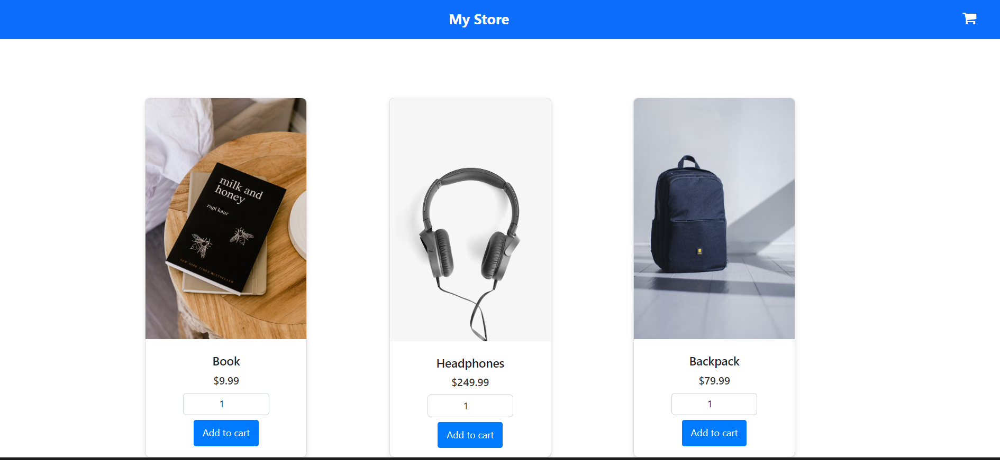
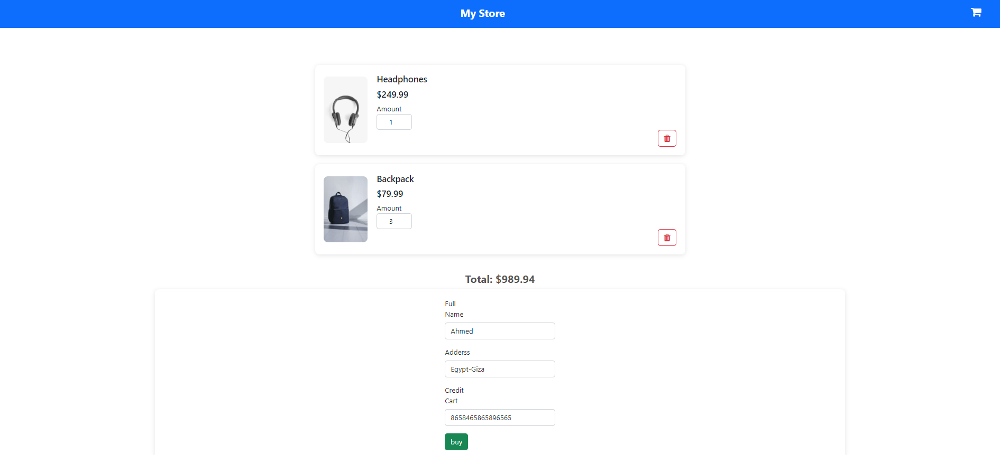

# My Store Udacity Angular Project

## Overview

This is a simple e-commerce application built using **Angular**. Users can browse through products, view details, add items to their shopping cart, and complete their purchase. The application demonstrates the use of Angular components, services, and routing to create a dynamic and responsive web application.

## Features

- Product listing page
- Product detail page
- Shopping cart
- Order confirmation page
- Responsive design

## Project Structure

- **src/app/components**: Contains the main components of the app such as the product list, product detail, cart, and order confirmation pages.
- **src/app/services**: Holds services that handle state and logic such as the cart service.
- **src/app/models**: Includes TypeScript interfaces used throughout the application.

## Usage

- Browse through the available products.
- View product details by clicking on a product.
- Add products to the shopping cart and adjust quantities.
- Complete the purchase and view an order confirmation.

## Responsive Design

The project is designed to be responsive, ensuring compatibility across different device sizes.
## Setup and Installation

1. **Clone the repository:**
   ```bash
   git clone https://github.com/AbdallahAhmed0/Examination-Management-System.git
   
2. **Install dependencies:**
   ```bash
   npm install

3. **Run the application:**
   ```bash
   ng serve
 
This project was generated with [Angular CLI](https://github.com/angular/angular-cli) version 14.2.2.
The application will run on http://localhost:4200/.


 ## ScreenShots




